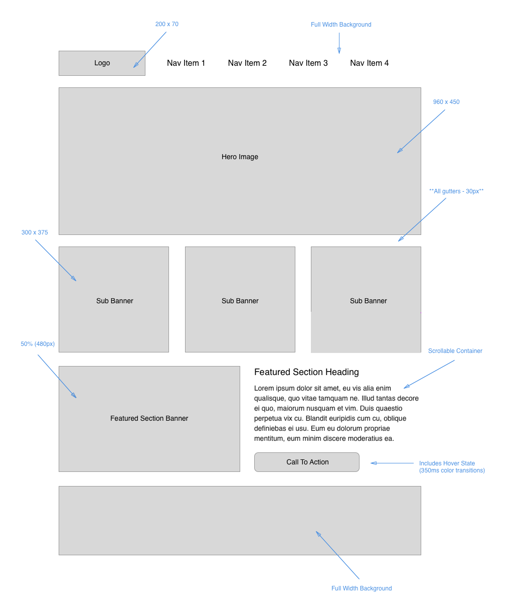

# HTML/CSS Wireframe Exercise

## Wireframe Overview

Create a new repo titled 'wirefame-exercise', making sure to configure it with `index.html`, `style.css`, and `reset.css` (use [Eric Meyer's reset](https://meyerweb.com/eric/tools/css/reset)).

You will be building a professional-style wireframe document, to a provided spec, using just HTML and CSS. This workflow is similar to what you would encounter in an environment where there is a designer on the team: the designer creates a ***design comp*** (short for *comprehensive*) that shows you what the final version should look like, plus, a document with annotations about specific sizes and features.

*Note: All of the images in this document are in the adjacent `images/` directory*

Here is the comp (a little smaller here to provide an overview):

Here is the annotated version (a little larger here to give details):

Notice how the comp is very professional and business-like, in black, white, and grays, with image dimensions clearly labeled. The comp was created using image placeholders from [placehold.it](placehold.it), which provides dimensions and makes it easy to style the color of the placeholder images by appending a hex color code to the URL. For instance, the code `` produces the following image, with a width of 200 pixels, a height, of 300 pixels, and color of `#DDD`, which is a light gray:

There are a lot of [image placeholder services](http://lmgtfy.com/?q=image+placeholder) out there, and although the temptation to build a wireframe with placeholder images of kittens or puppies or zombies is strong, you should resist. The same goes for using flamboyant color schemes on wireframes. Sure, it's fun, but does it come across as professional? You be the judge:

As for text, the industry standard for placeholder text is plain old ["Lorem ipsum"](https://www.lipsum.com) rather than all of the fun ***ipsum*** variants on the internet.

## Wireframe Process

Up to this point you've probably been building HTML pages (like the ones in the About Me and the Cookie Stand projects) like this:

1. Put some content into the HTML and apply markup
2. Apply some CSS to the HTML to try to get it to look the way you want.
3. Repeat Steps 1 and 2 some number of times until all content is in place.
4. Grow increasingly annoyed that your page does not look like you want.
5. "Oh no, I forgot, I better push this to GitHub!" and make your first ACP.

Basically, this happens:

This is NOT AT ALL how pros do it.

**Let's look at a professional approach to setting up a web document, or more specifically, the look and feel of an application.**

1. Have a design concept and a plan completely ready to go before you write the first line of code.
    - Wireframe showing all document dimensions
    - Know where images will go and how big they will be
    - Use placeholder images during the setup process
    - Know where text will go and use placeholder *lorem ipsum* text
2. Set up the project repository, scaffold the files, and make sure they are wired together.
3. ACP (Add, Commit, Push)
4. Build out all of the HTML without applying any classes or IDs
5. ACP
6. Working top to bottom in the document, put elements into place with CSS, using the structure of the HTML to create selectors wherever it is possible. Seek to limit use of classes and IDs to only where they are needed.
7. ACP
8. Apply color, backgrounds, borders, text styling, etc., to the specifications of the design.
9. ACP
10. Done!

With this wireframe in place, you can now present it to the designer and/or client for review, make any requested edits, and once there is a signoff on the wireframe, then it is time to start entering the actual content.